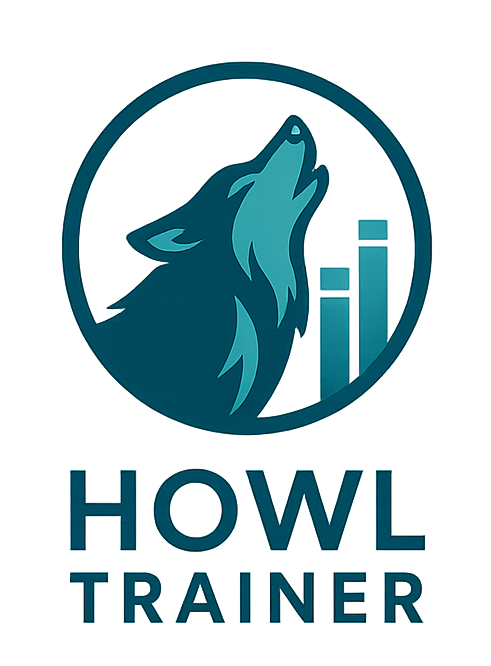

<p align="left">
  
</p>

# Howl Trainer – Detección de Feedback

Entrenador auditivo para identificar rápidamente **frecuencias de feedback** (bandas de 1/3 de octava).  
Incluye práctica guiada, registro de intentos y una página de **Stats** con análisis (KMeans) para recomendar en qué **región** enfocarte.

> Desarrollado por: Vannessa Martinez (Ingeniera de sonido) • Bootcamp IA

---

## 🧭 Funcionalidades

- **Práctica (UI)**: genera un objetivo “oculto”, reproduce el estímulo y registra tu respuesta.
- **Feedback pedagógico** (IA simbólica): mensajes claros según la distancia de bandas.
- **Registro de sesión**: guarda cada intento en `data/session_log.csv`.
- **Stats (KMeans)**: detecta **patrones de confusión** (≥ 8 errores) y recomienda región de práctica.
- **About**: guía de uso y tips dentro de la app.
- **Síntesis configurable** (interno): tono **puro** por defecto; modos “mixed/narrowband” disponibles en código.

---

## 🧱 Requisitos

- **macOS / Windows / Linux**
- **Python 3.12.9** (recomendado; en macOS instala desde python.org para incluir Tk)
- **PortAudio** viene integrado en las ruedas de `sounddevice` para macOS.

### Dependencias (pip)
```txt
numpy>=1.26.0
pandas>=2.1
scipy>=1.12.0
sounddevice>=0.4.6
scikit-learn>=1.5.0
pytest>=7.4
```

---

## 🚀 Instalación y ejecución

1) Clona el repo y entra al proyecto:
```bash
git clone <TU_REPO.git>
cd HowlTrainer
```

2) Crea y activa el entorno (ejemplo macOS, Python 3.12.9 oficial):
```bash
/Library/Frameworks/Python.framework/Versions/3.12/bin/python3 -m venv venv
source venv/bin/activate
python -V  # → 3.12.9
```

3) Instala dependencias:
```bash
pip install -r requirements.txt
```

4) Verifica entorno (opcional):
```bash
python check_env.py
```

5) Ejecuta la **UI**:
```bash
python main.py
```

6) (Opcional) Menú por consola y stats en CLI:
```bash
python run_tests_modular/run_menu_cli.py
python run_tests_modular/run_stats_cli.py
```

---

## 🖥️ Uso (flujo recomendado)

### Pestaña **Práctica**
1. **🎯 Nuevo objetivo** → define internamente una banda (frecuencia) **oculta**.  
2. **▶ Reproducir** → escucha el estímulo.  
3. Selecciona tu respuesta (Hz) → **✅ Responder**.  
4. Lee el **feedback** (correcto / distancia de bandas / sugerencias).  
5. Se registra el intento y se prepara automáticamente un **nuevo objetivo**.

> Tip: Activa **“Mostrar objetivo (debug)”** para familiarizarte al inicio; desactívalo para práctica real.

### Pestaña **Stats**
- Con **pocos errores** → **fallback**: accuracy global, peores bandas, errores por región y **barritas ASCII** por banda.  
- Con **≥ 8 errores** → **KMeans** para **patrones de confusión** + **recomendación** de práctica por región.

### Pestaña **About**
- Guía de uso, objetivos, consejos y créditos.

---

## 🧠 IA en Howl Trainer

- **IA simbólica (reglas)**: mensajes pedagógicos según la distancia entre banda objetivo y respuesta.  
- **Aprendizaje automático (KMeans)**: analiza errores y agrupa patrones para recomendar región de práctica.  
  - Activación con **≥ 8 errores** en `data/session_log.csv`.  
  - Selección automática de **k** (2..4) por **silhouette**.

---

## 🏗️ Estructura del proyecto

```
HowlTrainer/
├─ ai/
│  ├─ policy.py              # Selección de próxima banda (cooldown + exploración)
│  └─ rules.py               # Reglas simbólicas de feedback pedagógico
├─ analytics/
│  └─ cluster_analysis.py    # KMeans + helpers de análisis
├─ core/
│  ├─ bands.py               # Bandas de 1/3 de octava + utilidades
│  ├─ audio_io.py            # Reproducción (async/sync) con sounddevice
│  └─ synth.py               # Síntesis: seno puro, mixed, narrowband (con fades)
├─ ui/
│  ├─ pages/
│  │  ├─ tones_page.py       # Pestaña de práctica
│  │  ├─ stats_page.py       # Pestaña de estadísticas
│  │  └─ about_page.py       # Pestaña de ayuda
│  └─ dialogs/
│     └─ about.py            # Diálogo modal de ayuda
├─ assets/
│  └─ howl_logo.png          # Logo de la app (PNG, 256–512 px recomendado)
├─ data/
│  ├─ bands.csv              # Bandas de 1/3 de octava
│  └─ session_log.csv        # Registro (se genera al practicar)
├─ tests/
│  ├─ test_bands.py
│  ├─ test_rules.py
│  └─ test_synth.py
├─ run_tests_modular/
│  ├─ run_audio_test.py
│  ├─ run_kmeans_demo.py
│  ├─ run_menu_cli.py
│  ├─ run_practice_cli.py
│  ├─ run_stats_cli.py
│  └─ run_tests.py
├─ data_logger.py
├─ config.py
├─ check_env.py
├─ requirements.txt
└─ main.py
```

> **Nota:** si mantienes el nombre original de carpeta (`eartrainer_feedback`), deja ese nombre aquí también para coherencia.

---

## 🔊 Audio y síntesis

- **Por defecto**: tono **puro** (seno con fades) → sonido limpio, sin clicks.  
- Modos opcionales en `core/synth.make_feedback`:
  - `mode="mixed"`: seno + ruido estrecho (realismo leve).
  - `mode="narrowband"`: ruido estrecho centrado en f0 (realismo fuerte).  
- El **volumen** se controla en `audio_io.play_async(..., gain_db=...)`.

---

## 🧪 Pruebas

```bash
pytest -q
```

---

## 📊 Datos

- Archivo: `data/session_log.csv`.  
  Columnas: `timestamp, module, band_true, band_user, correct, rt_ms`.  
- KMeans usa **solo los errores** y genera **features** internas para clusterizar.

---

## 🛠️ Solución de problemas

- **Tkinter en macOS**: usa Python 3.12.9 de **python.org** (incluye Tk).  
  Crea el venv con la ruta absoluta de ese Python (ver comandos arriba).
- **“No module named _tkinter”**: probablemente el intérprete de Homebrew (3.11). Selecciona `./venv/bin/python` en VS Code.
- **Audio no suena**: revisa dispositivo de salida, baja `gain_db` si distorsiona y cierra apps que ocupen el dispositivo.
- **Stats sin KMeans**: asegúrate de tener **≥ 8 errores** en el CSV.
- **Tonos repetidos**: la política implementa **cooldown** y mezcla exploración/explotación.

---

## 🧩 Roadmap corto

- Atajos: `Space` (play/stop), `N` (nuevo), `Enter` (responder).
- Slider de volumen y selector de estímulo (Seno / Mixto / Narrowband).
- Matriz de confusiones por desplazamiento de bandas.
- Segundo módulo: “Ruido rosa + realce de banda”.

---

## 🤝 Créditos

- **Audio**: numpy, sounddevice  
- **Analítica**: pandas, scikit-learn  
- **UI**: Tkinter (ttk)  
- **Filtros** (opcional): SciPy

---

## 📄 Licencia

MIT.
